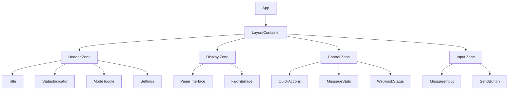

# Design Document: Layout Experiment

## Overview

This design introduces an experimental layout system for Retro Messenger that reimagines the spatial organization of interface components while maintaining the authentic retro aesthetic. The new layout aims to improve visual hierarchy, optimize screen real estate, and provide a more immersive messaging experience through strategic component positioning and flexible CSS architecture.

The design focuses on creating a modular, CSS-driven layout system that can be easily toggled or A/B tested against the current implementation, allowing for data-driven decisions about the optimal user interface arrangement.

## Architecture

### Layout System Structure

The layout experiment introduces a new CSS-based layout system that operates independently from component logic:

```
Layout System
├── Layout Container (CSS Grid/Flexbox)
├── Layout Zones (Semantic regions)
│   ├── Header Zone
│   ├── Primary Display Zone
│   ├── Secondary Control Zone
│   └── Input Zone
└── Layout Variants (CSS classes)
    ├── layout--default
    ├── layout--compact
    └── layout--experimental
```

### Design Principles

1. **Separation of Concerns**: Layout styling separated from component styling
2. **CSS Custom Properties**: All layout dimensions defined as CSS variables
3. **Progressive Enhancement**: Fallback layouts for older browsers
4. **Responsive First**: Mobile-optimized with desktop enhancements
5. **Animation Performance**: GPU-accelerated transitions using transform/opacity

## Components and Interfaces

### 1. Layout Container Component

**Purpose**: Wrapper component that applies experimental layout classes

**Interface**:
```javascript
<LayoutContainer variant="experimental">
  {children}
</LayoutContainer>
```

**Props**:
- `variant`: string - Layout variant to apply ('default' | 'compact' | 'experimental')
- `children`: ReactNode - Child components to render

**CSS Structure**:
```css
.LayoutContainer {
  display: grid;
  grid-template-areas:
    "header header"
    "display controls"
    "input input";
  grid-template-columns: 1fr 300px;
  grid-template-rows: auto 1fr auto;
  gap: var(--layout-gap, 1rem);
  height: 100vh;
  padding: var(--layout-padding, 1rem);
}
```

### 2. Layout Zones

#### Header Zone
- **Position**: Top spanning full width
- **Content**: App title, status indicator, mode toggle, settings
- **Height**: Fixed at 60px
- **Behavior**: Sticky on scroll

#### Primary Display Zone
- **Position**: Left column, main content area
- **Content**: Pager/Fax interface display
- **Flex**: Takes remaining vertical space
- **Behavior**: Scrollable overflow

#### Secondary Control Zone
- **Position**: Right column sidebar
- **Content**: Quick actions, message stats, webhook status
- **Width**: 300px (desktop), full width (mobile)
- **Behavior**: Collapsible on mobile

#### Input Zone
- **Position**: Bottom spanning full width
- **Content**: Message input, send button
- **Height**: Auto-sizing based on content
- **Behavior**: Fixed position on mobile

### 3. Experimental Layout Variants

#### Variant A: Split View
```
┌─────────────────────────────────┐
│         Header (60px)           │
├──────────────────┬──────────────┤
│                  │              │
│   Display Area   │   Controls   │
│   (flex: 1)      │   (300px)    │
│                  │              │
├──────────────────┴──────────────┤
│         Input (auto)            │
└─────────────────────────────────┘
```

#### Variant B: Compact View
```
┌─────────────────────────────────┐
│    Header + Controls (60px)     │
├─────────────────────────────────┤
│                                 │
│       Display Area (flex)       │
│                                 │
├─────────────────────────────────┤
│         Input (auto)            │
└─────────────────────────────────┘
```

#### Variant C: Immersive View
```
┌─────────────────────────────────┐
│                                 │
│       Display Area (100vh)      │
│   (Header overlay on hover)     │
│   (Input overlay at bottom)     │
│                                 │
└─────────────────────────────────┘
```

## Data Models

### Layout Configuration

```typescript
interface LayoutConfig {
  variant: 'default' | 'compact' | 'experimental';
  customProperties: {
    layoutGap: string;
    layoutPadding: string;
    headerHeight: string;
    sidebarWidth: string;
    inputHeight: string;
  };
  breakpoints: {
    mobile: number;
    tablet: number;
    desktop: number;
  };
  animations: {
    transitionDuration: number;
    transitionEasing: string;
  };
}
```

### Layout State

```typescript
interface LayoutState {
  currentVariant: string;
  isSidebarCollapsed: boolean;
  isHeaderVisible: boolean;
  viewportDimensions: {
    width: number;
    height: number;
  };
}
```

## Implementation Details

### CSS Custom Properties

Define all layout dimensions as CSS variables for easy modification:

```css
:root {
  /* Layout Spacing */
  --layout-gap: 1rem;
  --layout-padding: 1rem;
  --layout-border-radius: 8px;
  
  /* Zone Dimensions */
  --header-height: 60px;
  --sidebar-width: 300px;
  --input-min-height: 60px;
  
  /* Breakpoints */
  --breakpoint-mobile: 768px;
  --breakpoint-tablet: 1024px;
  --breakpoint-desktop: 1440px;
  
  /* Transitions */
  --transition-duration: 300ms;
  --transition-easing: cubic-bezier(0.4, 0, 0.2, 1);
  
  /* Z-index layers */
  --z-header: 100;
  --z-sidebar: 90;
  --z-modal: 1000;
  --z-toast: 1100;
}
```

### Responsive Breakpoints

```css
/* Mobile: < 768px */
@media (max-width: 767px) {
  .LayoutContainer {
    grid-template-areas:
      "header"
      "display"
      "input";
    grid-template-columns: 1fr;
    grid-template-rows: auto 1fr auto;
  }
  
  .LayoutContainer__sidebar {
    display: none; /* Hidden on mobile */
  }
}

/* Tablet: 768px - 1023px */
@media (min-width: 768px) and (max-width: 1023px) {
  .LayoutContainer {
    --sidebar-width: 250px;
  }
}

/* Desktop: >= 1024px */
@media (min-width: 1024px) {
  .LayoutContainer {
    --sidebar-width: 300px;
  }
}
```

### Animation System

All layout transitions use GPU-accelerated properties:

```css
.LayoutContainer__zone {
  transition: 
    transform var(--transition-duration) var(--transition-easing),
    opacity var(--transition-duration) var(--transition-easing);
  will-change: transform, opacity;
}

/* Mode switch animation */
.LayoutContainer--transitioning .LayoutContainer__display {
  animation: fadeInSlide var(--transition-duration) var(--transition-easing);
}

@keyframes fadeInSlide {
  from {
    opacity: 0;
    transform: translateY(10px);
  }
  to {
    opacity: 1;
    transform: translateY(0);
  }
}
```

### Layout Toggle Implementation

```javascript
// LayoutToggle.jsx
const LayoutToggle = () => {
  const [variant, setVariant] = useState('default');
  
  const handleVariantChange = (newVariant) => {
    // Add transitioning class
    document.body.classList.add('layout-transitioning');
    
    // Change variant
    setVariant(newVariant);
    
    // Remove transitioning class after animation
    setTimeout(() => {
      document.body.classList.remove('layout-transitioning');
    }, 300);
  };
  
  return (
    <div className="LayoutToggle">
      <button onClick={() => handleVariantChange('default')}>
        Default
      </button>
      <button onClick={() => handleVariantChange('experimental')}>
        Experimental
      </button>
    </div>
  );
};
```

## Error Handling

### Layout Fallbacks

1. **CSS Grid Not Supported**: Fallback to Flexbox layout
2. **Custom Properties Not Supported**: Fallback to hardcoded values
3. **Animation Not Supported**: Instant transitions without animation

```css
/* Fallback for browsers without CSS Grid */
@supports not (display: grid) {
  .LayoutContainer {
    display: flex;
    flex-direction: column;
  }
  
  .LayoutContainer__display {
    flex: 1;
  }
}
```

### Responsive Edge Cases

1. **Very Small Screens (< 320px)**: Minimum width enforcement
2. **Very Large Screens (> 2560px)**: Maximum width constraint
3. **Landscape Mobile**: Adjusted layout for horizontal orientation

```css
/* Minimum width enforcement */
.LayoutContainer {
  min-width: 320px;
}

/* Maximum width constraint */
@media (min-width: 2560px) {
  .LayoutContainer {
    max-width: 2560px;
    margin: 0 auto;
  }
}

/* Landscape mobile */
@media (max-height: 500px) and (orientation: landscape) {
  .LayoutContainer__header {
    height: 40px; /* Reduced header */
  }
}
```

## Testing Strategy

### Visual Regression Testing

1. **Snapshot Tests**: Capture layout at different breakpoints
2. **Component Tests**: Verify layout zones render correctly
3. **Interaction Tests**: Test layout transitions and animations

### Performance Testing

1. **Layout Shift Metrics**: Measure CLS (Cumulative Layout Shift)
2. **Animation Performance**: Monitor FPS during transitions
3. **Responsive Performance**: Test layout recalculation on resize

### Cross-Browser Testing

Test matrix:
- Chrome (latest, latest-1)
- Firefox (latest, latest-1)
- Safari (latest, latest-1)
- Edge (latest)
- Mobile Safari (iOS 15+)
- Chrome Mobile (Android 10+)

### Accessibility Testing

1. **Keyboard Navigation**: Verify tab order in new layout
2. **Screen Reader**: Test with NVDA/JAWS/VoiceOver
3. **Focus Management**: Ensure visible focus indicators
4. **Color Contrast**: Verify WCAG AA compliance

## Implementation Phases

### Phase 1: Foundation (Requirements 1, 5)
- Create LayoutContainer component
- Define CSS custom properties
- Implement default layout variant
- Set up layout configuration system

### Phase 2: Variants (Requirements 2, 3)
- Implement experimental layout variants
- Add responsive breakpoints
- Optimize for mobile devices
- Test across different screen sizes

### Phase 3: Animations (Requirement 4)
- Add layout transition animations
- Implement mode switch animations
- Optimize animation performance
- Add reduced motion support

### Phase 4: Testing & Refinement
- Conduct visual regression tests
- Perform accessibility audit
- Gather user feedback
- Iterate based on findings

## Design Decisions & Rationales

### Decision 1: CSS Grid over Flexbox
**Rationale**: CSS Grid provides better two-dimensional layout control and cleaner code for complex layouts. Flexbox fallback ensures compatibility.

### Decision 2: CSS Custom Properties for Configuration
**Rationale**: Allows runtime theme switching and easy A/B testing without JavaScript overhead. Better performance than inline styles.

### Decision 3: Separate Layout Component
**Rationale**: Maintains separation of concerns, allows easy toggling between layouts, and doesn't require refactoring existing components.

### Decision 4: GPU-Accelerated Animations
**Rationale**: Using transform and opacity ensures 60fps animations on most devices. Critical for maintaining retro aesthetic smoothness.

### Decision 5: Mobile-First Responsive Design
**Rationale**: Ensures optimal experience on smallest screens first, then progressively enhances for larger displays.

## Mermaid Diagrams

### Layout Component Hierarchy



### Layout Variant State Machine

```mermaid
stateDiagram-v2
    [*] --> Default
    Default --> Experimental: User Toggle
    Experimental --> Compact: User Toggle
    Compact --> Default: User Toggle
    
    Default --> Transitioning: Change Initiated
    Experimental --> Transitioning: Change Initiated
    Compact --> Transitioning: Change Initiated
    
    Transitioning --> Default: Animation Complete
    Transitioning --> Experimental: Animation Complete
    Transitioning --> Compact: Animation Complete
```

### Responsive Breakpoint Flow


## Future Enhancements

1. **User Preferences**: Save preferred layout variant to localStorage
2. **Layout Analytics**: Track which layouts users prefer
3. **Dynamic Layouts**: AI-suggested layouts based on usage patterns
4. **Custom Layouts**: Allow users to create custom layout configurations
5. **Layout Presets**: Predefined layouts for different use cases (focus mode, archive mode, etc.)

## Conclusion

This design provides a flexible, performant, and maintainable layout system that enhances the Retro Messenger user experience while preserving its unique aesthetic. The modular approach allows for easy experimentation and iteration based on user feedback and analytics data.
