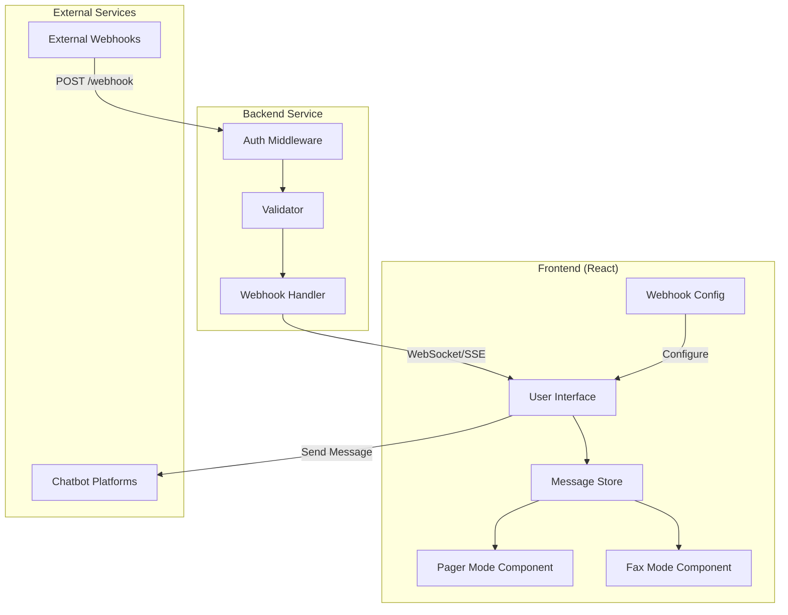

# Design Document

## Overview

Retro Messenger is a single-page React application that simulates vintage communication devices (pagers and fax machines) using modern web technologies. The application consists of a frontend React UI with two distinct interface modes, a lightweight backend service for webhook handling, and integration points for chatbot platforms. The design emphasizes nostalgic aesthetics while maintaining reliability and security.

## Architecture

### High-Level Architecture



### Technology Stack

- **Frontend**: React 18+ with hooks, React Router for navigation
- **State Management**: React Context API with useReducer for message queue
- **Styling**: CSS Modules with retro-themed custom properties
- **Backend**: Node.js with Express for webhook endpoints
- **Real-time Communication**: Server-Sent Events (SSE) for pushing messages to frontend
- **Storage**: Browser LocalStorage for configuration and message history
- **Build Tool**: Vite for fast development and optimized production builds

## Components and Interfaces

### Frontend Components

#### 1. App Component
- Root component managing routing and global state
- Provides MessageContext for sharing message queue across components
- Handles mode switching between pager and fax interfaces

#### 2. PagerInterface Component
```typescript
interface PagerInterfaceProps {
  messages: Message[];
  onSendMessage: (content: string) => void;
}

interface Message {
  id: string;
  content: string;
  timestamp: number;
  sender?: string;
}
```

**Responsibilities:**
- Display messages in monospace font with green-on-black theme
- Truncate messages to 240 characters
- Play beep sound on new message arrival
- Maintain scrollable history of last 50 messages
- Provide input field for sending messages

#### 3. FaxInterface Component
```typescript
interface FaxInterfaceProps {
  messages: Message[];
  onSendMessage: (content: string) => void;
}

interface FaxDocument {
  id: string;
  imageDataUrl: string;
  timestamp: number;
  sender?: string;
}
```

**Responsibilities:**
- Render messages as fax document images using Canvas API
- Apply visual effects (scan lines, paper texture, distortion)
- Animate transmission with progressive line rendering
- Generate fax header with timestamp
- Store up to 100 rendered documents in archive

#### 4. WebhookConfig Component
```typescript
interface WebhookSettings {
  incomingUrl: string;
  outgoingUrl: string;
  authToken?: string;
  enableAuth: boolean;
}
```

**Responsibilities:**
- Provide form for configuring webhook URLs
- Validate URL formats
- Manage authentication token settings
- Persist configuration to LocalStorage
- Display current webhook endpoint for incoming messages

#### 5. StatusIndicator Component
```typescript
interface ConnectionStatus {
  connected: boolean;
  error?: string;
  lastUpdate: number;
}
```

**Responsibilities:**
- Display visual connection status (connected/disconnected/error)
- Show configuration prompt when disconnected
- Update status based on webhook health checks

#### 6. ModeToggle Component
- Toggle switch between pager and fax modes
- Persist mode preference to LocalStorage
- Smooth transition animations

### Backend Components

#### 1. Webhook Handler
```typescript
interface WebhookPayload {
  message: string;
  sender?: string;
  timestamp?: number;
  metadata?: Record<string, any>;
}

interface WebhookResponse {
  success: boolean;
  messageId?: string;
  error?: string;
}
```

**Endpoints:**
- `POST /api/webhook` - Receive incoming messages
- `GET /api/messages/stream` - SSE endpoint for real-time message delivery
- `POST /api/send` - Send messages to external chatbot webhooks

#### 2. Authentication Middleware
```typescript
interface AuthConfig {
  enabled: boolean;
  token: string;
}
```

**Responsibilities:**
- Validate Bearer tokens in Authorization header
- Return 401 for invalid/missing tokens when auth enabled
- Pass through requests when auth disabled

#### 3. Message Validator
**Responsibilities:**
- Validate JSON payload structure
- Sanitize message content (strip HTML, prevent XSS)
- Enforce message length limits
- Return 400 for malformed requests

## Data Models

### Message Model
```typescript
interface Message {
  id: string;              // UUID v4
  content: string;         // Sanitized message text
  timestamp: number;       // Unix timestamp in milliseconds
  sender?: string;         // Optional sender identifier
  metadata?: {
    platform?: string;     // Source platform (e.g., "slack", "discord")
    channelId?: string;    // Source channel/room identifier
  };
}
```

### Configuration Model
```typescript
interface AppConfig {
  webhooks: {
    incoming: string;      // Backend webhook URL
    outgoing: string;      // External chatbot webhook URL
    authToken?: string;    // Optional auth token
    enableAuth: boolean;   // Auth toggle
  };
  preferences: {
    mode: 'pager' | 'fax'; // Current interface mode
    soundEnabled: boolean;  // Notification sound toggle
  };
  messageHistory: Message[]; // Persisted messages (max 100)
}
```

## Error Handling

### Frontend Error Handling

1. **Webhook Configuration Errors**
   - Invalid URL format: Display inline validation error
   - Connection test failure: Show error banner with retry option

2. **Message Send Failures**
   - Network error: Display toast notification with retry button
   - Implement exponential backoff (1s, 2s, 4s) for up to 3 retries
   - Log failures to browser console

3. **SSE Connection Errors**
   - Automatic reconnection with exponential backoff
   - Display connection status in StatusIndicator
   - Queue messages locally during disconnection

4. **Rendering Errors**
   - Fax rendering failure: Fall back to plain text display
   - Canvas API unavailable: Show warning and disable fax mode

### Backend Error Handling

1. **Authentication Errors**
   - Return 401 with `{ error: "Unauthorized" }` for invalid tokens
   - Log authentication attempts

2. **Validation Errors**
   - Return 400 with `{ error: "Invalid payload", details: [...] }`
   - Sanitize error messages to avoid leaking system info

3. **External Webhook Errors**
   - Retry failed outgoing webhooks 3 times with exponential backoff
   - Return 500 with `{ error: "Failed to deliver message" }` after retries exhausted
   - Log all webhook transmission attempts

4. **Server Errors**
   - Global error handler catches unhandled exceptions
   - Return 500 with generic error message
   - Log full error details server-side

## Testing Strategy

### Unit Tests

1. **Component Tests**
   - PagerInterface: Message display, truncation, sound playback
   - FaxInterface: Canvas rendering, animation timing
   - WebhookConfig: URL validation, LocalStorage persistence
   - StatusIndicator: Status updates, visual states

2. **Utility Tests**
   - Message sanitization functions
   - URL validation logic
   - LocalStorage helpers
   - Retry logic with exponential backoff

### Integration Tests

1. **Frontend Integration**
   - Mode switching preserves message history
   - Configuration changes update connection status
   - Message flow from SSE to UI components

2. **Backend Integration**
   - Webhook endpoint receives and validates messages
   - Authentication middleware blocks unauthorized requests
   - SSE streams messages to connected clients
   - Outgoing webhook delivery with retries

### End-to-End Tests

1. **Message Flow**
   - Send message via external webhook → appears in pager interface
   - Send message via external webhook → renders as fax document
   - Send message from UI → delivered to external chatbot webhook

2. **Configuration Flow**
   - Configure webhooks → save → reload page → configuration persists
   - Enable authentication → unauthorized request rejected
   - Switch modes → message history preserved

### Manual Testing

1. **Visual/Audio Testing**
   - Pager beep sound quality and timing
   - Fax rendering visual effects and animations
   - Responsive layout on different screen sizes

2. **Performance Testing**
   - Message rendering performance with 50+ messages
   - Fax generation time for long messages
   - SSE connection stability over extended periods

## Implementation Notes

### Fax Rendering Algorithm

The fax rendering system uses HTML5 Canvas to generate document images:

1. Create canvas with A4-like aspect ratio (595x842px scaled)
2. Apply paper texture background
3. Render fax header with timestamp and sender info
4. Wrap message text with appropriate margins
5. Apply post-processing effects:
   - Horizontal scan lines (1px every 2-3px)
   - Slight rotation (0.5-1 degree)
   - Noise/grain overlay
   - Slight blur for authenticity
6. Export as data URL for display

### Real-time Message Delivery

Server-Sent Events (SSE) provides unidirectional real-time updates:

- Backend maintains open connections to active clients
- On webhook receipt, broadcast message to all connected clients
- Frontend reconnects automatically on connection loss
- Fallback to polling if SSE unavailable (older browsers)

### Security Considerations

1. **Input Sanitization**: All message content sanitized using DOMPurify or similar
2. **CORS Configuration**: Restrict origins in production
3. **Rate Limiting**: Implement rate limiting on webhook endpoint (e.g., 100 req/min per IP)
4. **Token Storage**: Store auth tokens securely in LocalStorage (not in URL params)
5. **HTTPS Only**: Enforce HTTPS in production for webhook endpoints
